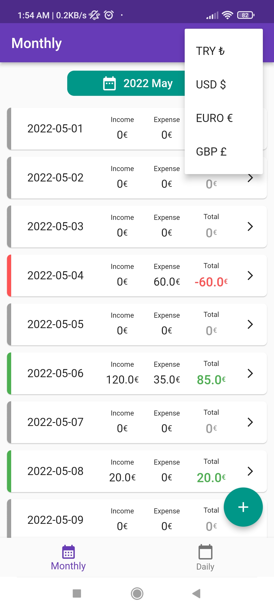
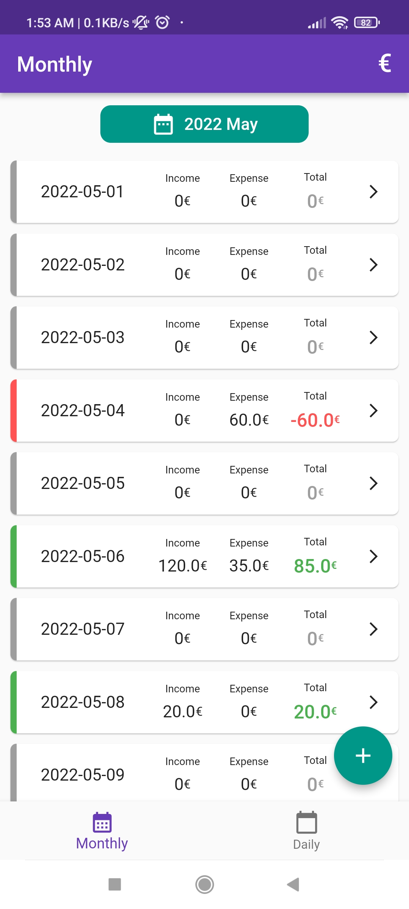
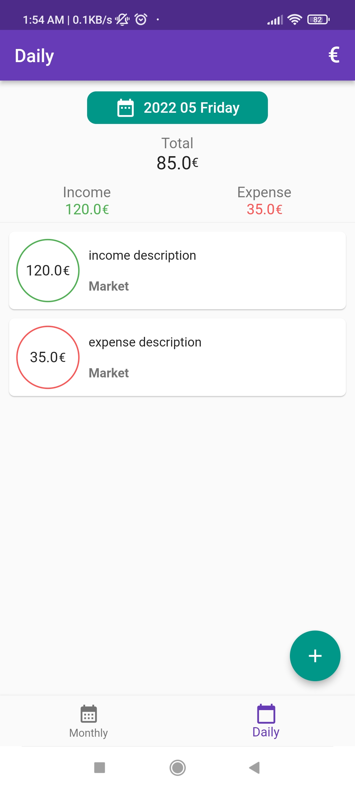
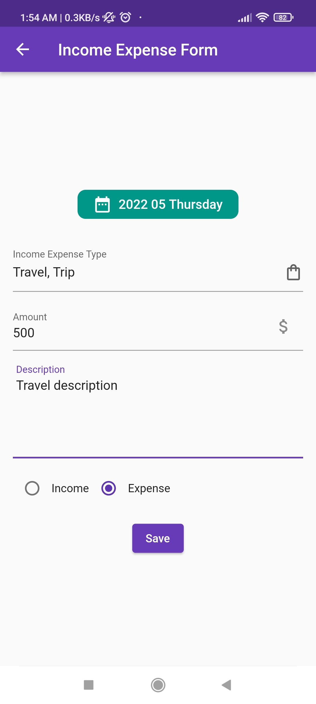

# Flutter Income-Expense App

<p float="left">
  
   
  
  
</p>

## Features

* Available 4 currency.
* Monthly income expense list.
* Daily income expense detail.
* Easily add income or expense.

## How To Use

To clone and run this application, you'll need [Git](https://git-scm.com) and [Flutter](https://flutter.dev/docs/get-started/install) installed on your computer. From your command line:

```bash
# Clone this repository
$ git clone https://github.com/huseyiniriss/flutter-income-expense-app.git

# Go into the repository
$ cd flutter-income-expense-app

# Install dependencies
$ flutter packages get

# Run the app
$ flutter run
```

## Download

You can [download](https://github.com/huseyiniriss/flutter-income-expense-app/blob/main/apk/app-release.apk) apk file for Android.

## License

MIT

---
